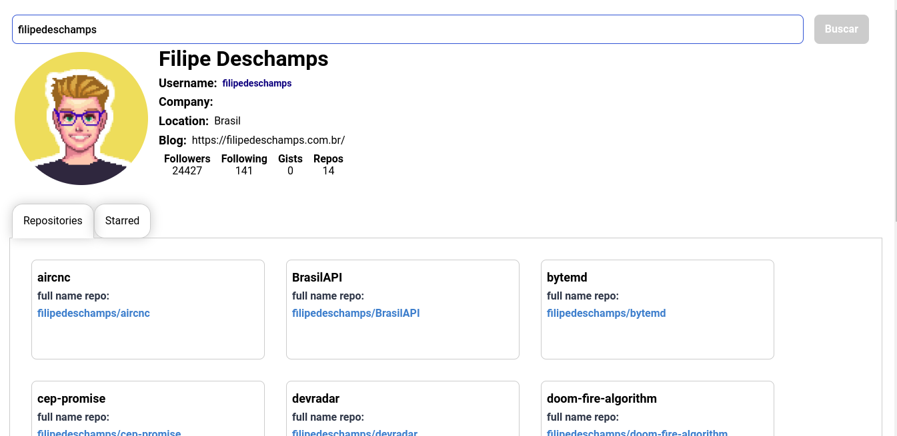

# GitHub Users

Projeto desenvolvido no bootcamp da [DIO](https://www.dio.me).

Utilizando a API do GiHub, a página renderiza as informações da conta pesquisada.

# Tecnologias utilizadas
- [TypeScript](https://www.typescriptlang.org/)
- [ReactJS](https://reactjs.org/)
- [Styled-Components](https://styled-components.com/)

# Screenshots
### Tela principal



# Requisitos mínimos para executar o projeto
Ter o [Node.js](https://nodejs.org/en/download/) instalado na sua máquina.

# Como executar o projeto

```bash

# clone o repositório
git clone https://github.com/wendellmoraisz/githubUsers.git

#entre no diretório do projeto e execute os seguintes comandos no seu terminal:
npm install
npm start
```
